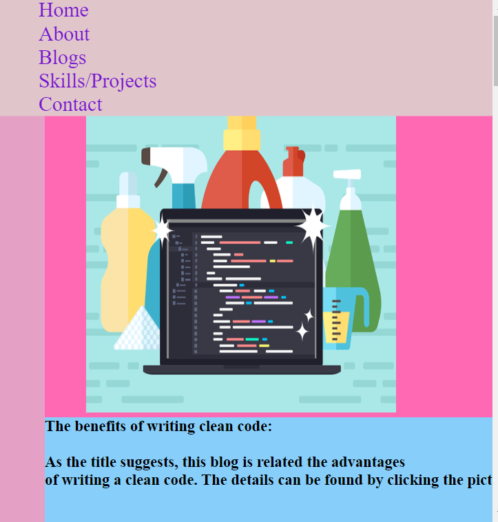

# **Portfolio Website: Amrit Sagar Khanal**
# **Links**
Deployed Website: https://amrithub.github.io/T1A3/index.html

Github Address: https://github.com/amrithub
## Purpose of the project:
Since being my first website design, the primary objective of this project is to practice as much web design techniwues as possible.
The basic purpose of my portfolio website is to apply and demonstrate my development and design skills. The website  exposes  my skillsto  perform my project planning. 

Along with the successful completion of my project, I have been able to practice several aspects of webpage designing including html and css. Many other techniques like linking, responsive design and subroutine integration were also the vital part of my learning and practice.

## Features

I have tried to simplify this project as much as possible in terms of coding techniques as it was going to demonstrate my initial and basic knowledge in website design.

### 1. Color:

Different colors have been styled using css and this has been applied along the body, navigation bar and the links.

### 2. Navigation Bars:

Navigation bar is quite essential for all the pages of the website. User needs links to navigate to different pages and if there are more than two links, it looks better to put all the links in a bar and display the bar somewhere consistently on the pages. Also, the hover feature makes the navigation bar more interactive. 

- Sticky navgation bar:
Tese navigation bars appear on the samme position even if we scrool up or down or by side. These are quite helpful when we want to navigate to another page from any current position of the web page. The link bar on my portfolio website's page appears at the top position whethe I scroll down or up.

Before Scrolling

After scrolling down

### 3. Flex and Flex box:
Flex boxes make webpage design more relaxed and mkes the layout of the webpage more attractive. It is also quite easy to arrange the navigation bar items horizontally or vertically by the use of flex in order to address responsiveness of the web design. The navigation bar in the webpage is designed by flex technique

### 4. My Downloadable Resume:
My resume in pdf format can be downloaded by clicking the 'Resume' botton on the navigation bar of the 'About' page.

Download button is added in the About me page. By clicking the download button potential employer will be able to download my PDF copy of CV. 

It is in the buttom of the page and has also hover effect to show it is clickable. The link is large, bolded and has download image in the button. 

### 5. The hover effect:
Hover effect makes the page more interactive because the user can be even certain where he/she is pointing by the change of color of the link item. I have used light blue color for hover effect. In this website, not only the navigation links but the whole navigation bar hovers when pointed.

### 6. Contact page and icons:
The contact page is quite precise and instead of unnecessary texts and other decorations, the linkable and styled icons are presented regarding yahoo mail, twitter, facebook and linkedin. Any potential recruiter can contact by clicking the respective icon.

## Other Vital features

### 1. Responsive Design:

 Since the user or the webpage visitor may be using any device of any size, example, mobile or desktop or pads and tabs, I have made the design responsive so that the page is compatible to any window. I have used the Media Queries in CSS file. When the user is using desktop, the navigation bars and the flex boxes (image and text) in all the pages appear horizontally alligned but if it is a mobile screen, they will be alligned vertically so that it is more responsive and comfortable for the user. The screenshots regarding desktop and mobile view is presented below:

  PIC

  This was achieved by using CSS Flexbox, which makes it possible to adjust the positioning of elements in response to a change in screen size. On a smartphone as small as an iPhone 5/SE, the website is designed to view correctly. In order to achieve such effects on browsers, a media break point was set to' min-width: 768px.' Pages such as blogs and ventures will have 2 rows of layout in a laptop.
  
 ### 2. Version Control: 
 Git and Github has been used for controlling the development of the page and change of features. Regarding this website, there are three branches, master, red and green. In red and green branch, the background of the page are red and green respectively. But ultimately, the red background seemed more professional and thats why I merged the red branch to the master branch. Several codes related to git were run in the command line for version control.

 

 ### 3. Meaning names for classes and divs:

 Semantic HTML feature has been applied to make the code more readable and understandable. Tags like container, image has been used  and 

 the classes and ids used in CSS are also defined in such a way that they refer to the code's actual intention. Container is used as a package.
  

### 4. Subresource integrity (SRI):

  SRI is a very important aspect of webpage design. SRI assures that the files a web designer received  do not have any unexpected malicious code and characters on behalf of a third party. Because subresource integrity is very necessary, a hash is created using sha512 and used in our HTML link tags. This is to ensure that the page will only load with styles when the sha512 hash was formed, if it is identical to its state. Any changes made to the website would load the HTML file without the styling of CSS.

  

## Sitemap

 A sitemap for the website is presented below:

## Design brief

### Pinterest
I have mainly chosen blue color in my site because it is a gentle color and it gives better view. My mood board is as below:

### WireFrame:

## Project Management tool (Trello) screenshots

## **WEbsite screenshots:**
## Homepages:
Homepages for desktop and mobile view:
## Desktop view:

## Mobile view:

## About pages:
## Dsktop

## Mobile:

## Blogs:

## Dsktop

## Mobile:

## Projects:

## Dsktop

## Mobile:

## About:
## Dsktop

## Mobile:

## Contact page:
## Dsktop

## Mobile:

## **Target Audience Potential employers and recruiting agencies**
Educators and devs
Family, friends and relatives
Businesses
## **Technology applied**
Programming languages: HTML, CSS
Source control: git & GitHub
Planning & implementation: 1. project management (Trello), 2. mood board (Pinterest), 3. wireframe (Balsamiq)
Deployment platform: Github
Subresource Integrity hash: sha-512
## **Future Extensions:**
Adding an collapsable menu bar when screen goes small
Designing personal logo for branding
More Images
Learn grid and create more meaningful design
